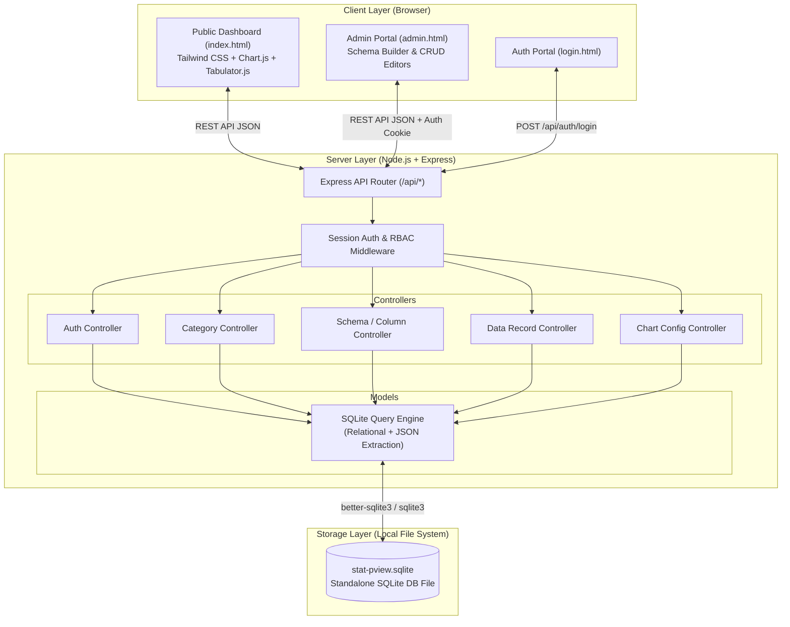
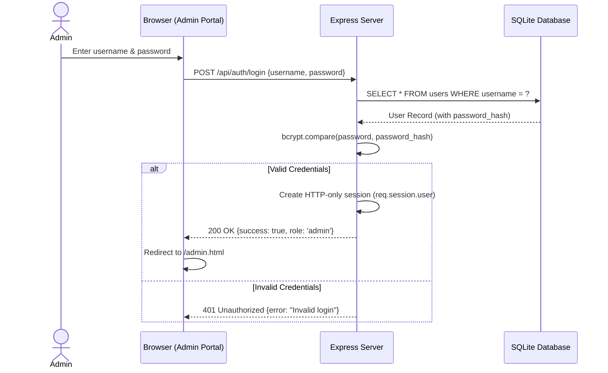
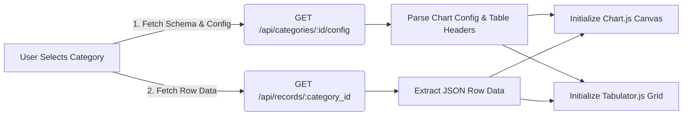

# System Architecture & Technical Specifications (`architecture.md`)

This document details the system architecture, component interactions, and data flow for **Statistic Public View**. Designed for high performance, portability, and zero-migration schema flexibility, the platform leverages a Node.js + Express backend paired with a hybrid SQLite database and a responsive Tailwind CSS frontend.

---

## 1. High-Level System Architecture Diagram



---

## 2. Backend Architecture

### 2.1 Pattern & Modular Layers
The backend follows a strict **Model-View-Controller (MVC) / Layered Architecture**:
* **Routes (`/src/routes`)**: Define HTTP verbs (`GET`, `POST`, `PUT`, `DELETE`), endpoint paths, and attach appropriate authentication middleware.
* **Middlewares (`/src/middlewares`)**: 
  * `authMiddleware.js`: Verifies that `req.session.user` exists.
  * `adminOnly.js`: Ensures `req.session.user.role === 'admin'` before allowing state-mutating requests.
* **Controllers (`/src/controllers`)**: Handle HTTP requests, parse payloads, validate input formats, coordinate model calls, and return structured JSON responses.
* **Models (`/src/models`)**: Encapsulate all SQLite database interactions using parameterized queries.

### 2.2 Authentication Flow


---

## 3. Dynamic Schema Architecture (Hybrid Relational + JSON)

A major technical challenge in dynamic dashboard builders is enabling custom columns and rows without executing database schema DDL migrations (`ALTER TABLE ADD COLUMN`), which can lock tables and degrade performance.

### How Our EAV / JSON Approach Works:
1. **Schema Definition (`custom_columns` table)**:
   * When an Admin adds a column (e.g., "Monthly Revenue" of type `number`), a row is inserted into `custom_columns` with `category_id`, `column_name = 'monthly_revenue'`, and `data_type = 'number'`.
2. **Data Storage (`data_records` table)**:
   * When data rows are entered, values are stored as a single JSON object inside the `data` text column of `data_records`:
     ```json
     {
       "month": "January 2026",
       "monthly_revenue": 45000,
       "is_audited": true
     }
     ```
3. **Query & Extraction**:
   * SQLite provides high-performance JSON functions (`json_extract()`, `json_tree()`, and `json_group_array()`).
   * When rendering a chart that maps X-axis to `month` and Y-axis to `monthly_revenue`, the backend executes:
     ```sql
     SELECT 
       json_extract(data, '$.month') AS x_label,
       json_extract(data, '$.monthly_revenue') AS y_value
     FROM data_records
     WHERE category_id = ?
     ORDER BY id ASC;
     ```

---

## 4. Frontend Architecture

### 4.1 Client-Side State & DOM Rendering
The frontend is built using clean, modular ES6 JavaScript without heavy bundling requirements during prototyping:
* **`dashboard.js`**:
  1. On page load, calls `GET /api/categories` and populates the category navigation tabs/dropdown.
  2. When a category is selected, fetches `/api/charts/:category_id` and `/api/records/:category_id`.
  3. Rebuilds the **Chart.js** instance and re-initializes the **Tabulator.js** table grid.
* **`admin.js`**:
  1. Manages modal dialogs for Category CRUD and Custom Column definitions.
  2. Dynamically generates form input fields (`<input type="text|number|date">` or `<select>`) based on fetched column metadata.
  3. Sends serialized JSON bodies to the REST API endpoints.

### 4.2 Chart & Table Integration Flow

