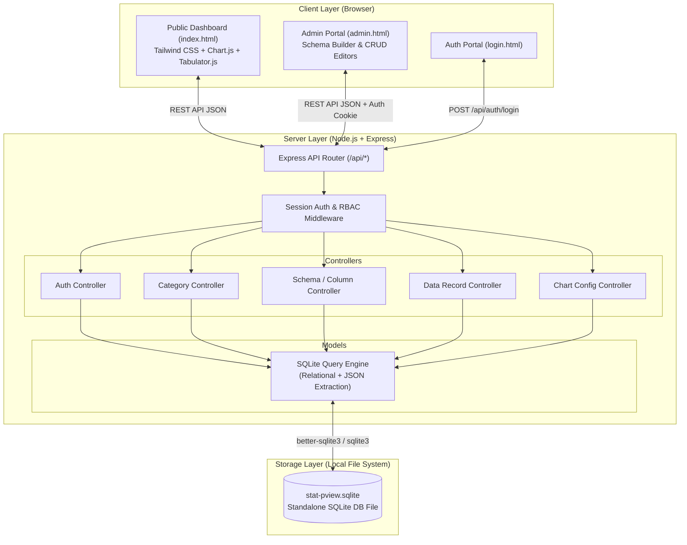
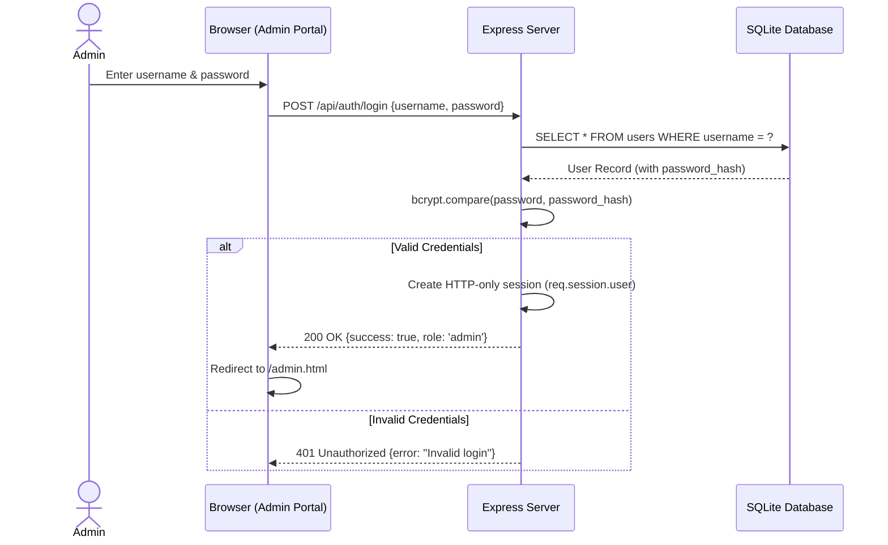
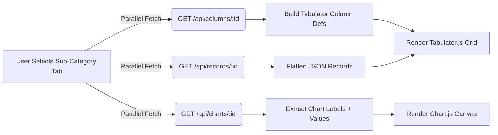

# System Architecture & Technical Specifications (`architecture.md`)

This document details the system architecture, component interactions, and data flow for **Statistic Public View**. Designed for high performance, portability, and zero-migration schema flexibility, the platform leverages a Node.js + Express backend paired with a hybrid SQLite database and a responsive Tailwind CSS frontend.

---

## 1. High-Level System Architecture Diagram



---

## 2. Backend Architecture

### 2.1 Pattern & Modular Layers
The backend follows a strict **Model-View-Controller (MVC) / Layered Architecture**:
* **Routes (`/src/routes`)**: Define HTTP verbs (`GET`, `POST`, `PUT`, `DELETE`), endpoint paths, and attach appropriate authentication middleware.
* **Middlewares (`/src/middlewares`)**: 
  * `authMiddleware.js`: Verifies that `req.session.user` exists.
  * `adminOnly.js`: Ensures `req.session.user.role === 'admin'` before allowing state-mutating requests.
* **Controllers (`/src/controllers`)**: Handle HTTP requests, parse payloads, validate input formats, coordinate model calls, and return structured JSON responses.
* **Models (`/src/models`)**: Encapsulate all SQLite database interactions using parameterized queries.

### 2.2 Authentication Flow


---

## 3. Dynamic Schema Architecture (Two-Tier Hybrid Relational + JSON)

A major technical challenge in dynamic dashboard builders is enabling custom columns and rows without executing database schema DDL migrations (`ALTER TABLE ADD COLUMN`), which can lock tables and degrade performance. We solve this by structuring data in a **two-tier hierarchy (Category → Sub-Category)** where custom columns and JSON records belong to a specific Sub-Category:

### How Our EAV / JSON Approach Works:
1. **Two-Tier Hierarchy (`categories` & `sub_categories` tables)**:
   * Top-level categories (e.g., *Data Rumah Ibadah*) contain only an icon and title.
   * Underneath, sub-categories (e.g., *Data Masjid*, *Data Gereja*) hold the actual data definitions.
2. **Schema Definition (`custom_columns` table)**:
   * When an Admin adds a column (e.g., "Nama Masjid" of type `text`), a row is inserted into `custom_columns` with `sub_category_id`, `column_name = 'nama_masjid'`, and `data_type = 'text'`.
3. **Data Storage (`data_records` table)**:
   * When data rows are entered, values are stored as a single JSON object inside the `data` text column of `data_records`, linked to `sub_category_id`:
     ```json
     {
       "nama_masjid": "Masjid Taqwa Metro",
       "kecamatan": "Metro Pusat",
       "jamaah": 500
     }
     ```
4. **Query & Extraction**:
   * SQLite provides high-performance JSON functions (`json_extract()`, `json_tree()`, and `json_group_array()`).
   * When rendering a chart or table for a sub-category, the backend executes:
     ```sql
     SELECT 
       id,
       json_extract(data, '$.nama_masjid') AS label,
       json_extract(data, '$.jamaah') AS value
     FROM data_records
     WHERE sub_category_id = ?
     ORDER BY id ASC;
     ```

---

## 4. Frontend Architecture

### 4.1 Client-Side Modules (ES6)
The frontend is built using clean, modular ES6 JavaScript (`type="module"`) without heavy bundling:

| Module | Responsibility |
|--------|---------------|
| `api-service.js` | Modular `fetch()` wrappers for all API endpoints (including subcategory CRUD), global error handling, and toast notification system |
| `chart-handler.js` | Dynamic Chart.js renderer supporting `bar`, `line`, `pie`, `doughnut`, `area` with named gradient palettes (`default`, `indigo`, `emerald`, `rose`) linked to `sub_category_id` |
| `table-handler.js` | Dynamic Tabulator.js grid builder — auto-translates `custom_columns` into formatted column definitions with number/date/boolean formatting |
| `dashboard.js` | Orchestrator — dark mode, auth state check, 3x3 category grid landing, horizontal sub-category tab bar selection, parallel data loading, empty-state handling |
| `admin-categories.js` | Admin manager for clean category cards and a modal/drawer interface to manage sub-categories |
| `admin-schema.js` | Admin cascaded schema builder with synchronized Category and Sub-Category selectors |

### 4.2 Chart & Table Integration Flow


