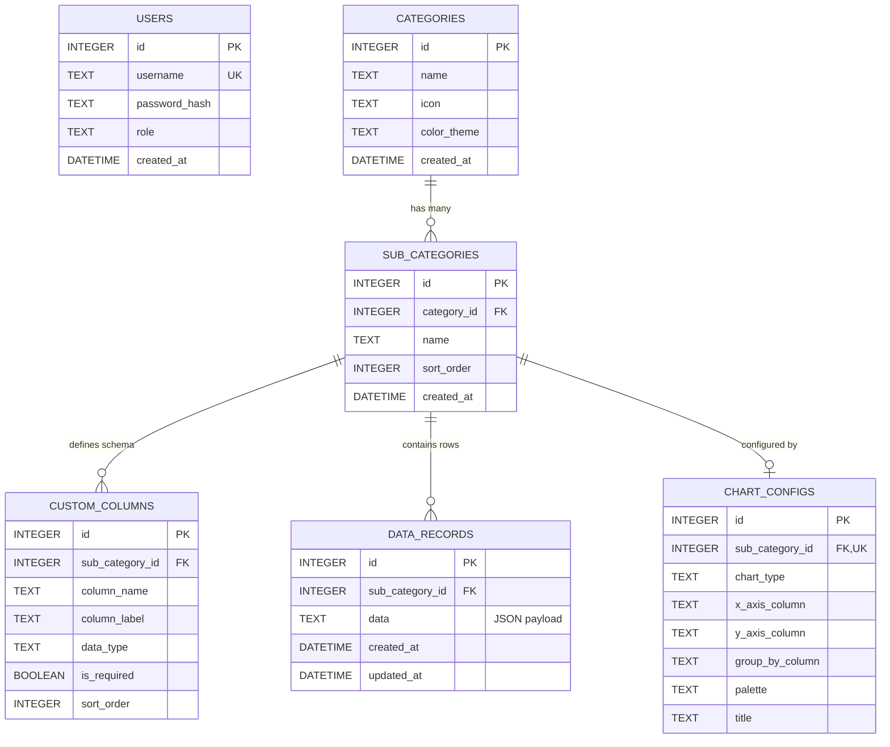

# Database Schema & Entity-Relationship Diagram (`database_schema.md`)

This document defines the SQLite database schema, table relations, and sample queries for **Statistic Public View**. We use a two-tier hybrid architecture combining standard relational integrity (Categories → Sub-Categories) with JSON storage for user-defined attributes.

> **Note**: The database file is environment-aware. In development mode, the app uses `data/stat-pview-dummy.sqlite` with auto-seeded demo data. In production mode, it uses `data/stat-pview-prod.sqlite` with real credentials from environment variables. Both are git-ignored.

---

## 1. Entity-Relationship Diagram (ERD)



---

## 2. SQL Create Table Definitions (DDL)

These SQLite DDL statements will be automatically executed by the initialization script (`src/config/database.js`) when the server boots.

### 2.1 `users` Table
Stores authentication credentials and role permissions.
```sql
CREATE TABLE IF NOT EXISTS users (
    id INTEGER PRIMARY KEY AUTOINCREMENT,
    username TEXT UNIQUE NOT NULL,
    password_hash TEXT NOT NULL,
    role TEXT CHECK(role IN ('admin', 'user')) DEFAULT 'user',
    created_at DATETIME DEFAULT CURRENT_TIMESTAMP
);
```

### 2.2 `categories` Table
Stores top-level statistical datasets or information tabs (Icon + Title only).
```sql
CREATE TABLE IF NOT EXISTS categories (
    id INTEGER PRIMARY KEY AUTOINCREMENT,
    name TEXT NOT NULL,
    icon TEXT DEFAULT 'chart-bar',
    color_theme TEXT DEFAULT 'emerald',
    created_at DATETIME DEFAULT CURRENT_TIMESTAMP
);
```

### 2.3 `sub_categories` Table
Stores sub-categories under top-level categories (e.g. Data Masjid under Data Rumah Ibadah).
```sql
CREATE TABLE IF NOT EXISTS sub_categories (
    id INTEGER PRIMARY KEY AUTOINCREMENT,
    category_id INTEGER NOT NULL,
    name TEXT NOT NULL,
    sort_order INTEGER DEFAULT 0,
    created_at DATETIME DEFAULT CURRENT_TIMESTAMP,
    FOREIGN KEY (category_id) REFERENCES categories(id) ON DELETE CASCADE
);

CREATE INDEX IF NOT EXISTS idx_subcats_category ON sub_categories(category_id);
```

### 2.4 `custom_columns` Table
Defines the dynamic table schema for each statistical sub-category.
```sql
CREATE TABLE IF NOT EXISTS custom_columns (
    id INTEGER PRIMARY KEY AUTOINCREMENT,
    sub_category_id INTEGER NOT NULL,
    column_name TEXT NOT NULL,
    column_label TEXT NOT NULL,
    data_type TEXT CHECK(data_type IN ('text', 'number', 'date', 'boolean', 'select')) DEFAULT 'text',
    is_required BOOLEAN DEFAULT 0,
    sort_order INTEGER DEFAULT 0,
    FOREIGN KEY (sub_category_id) REFERENCES sub_categories(id) ON DELETE CASCADE,
    UNIQUE(sub_category_id, column_name)
);
```

### 2.5 `data_records` Table
Stores flexible data rows as JSON payloads linked to a sub-category.
```sql
CREATE TABLE IF NOT EXISTS data_records (
    id INTEGER PRIMARY KEY AUTOINCREMENT,
    sub_category_id INTEGER NOT NULL,
    data TEXT NOT NULL CHECK(json_valid(data)),
    created_at DATETIME DEFAULT CURRENT_TIMESTAMP,
    updated_at DATETIME DEFAULT CURRENT_TIMESTAMP,
    FOREIGN KEY (sub_category_id) REFERENCES sub_categories(id) ON DELETE CASCADE
);

-- Index on sub_category_id for fast retrieval
CREATE INDEX IF NOT EXISTS idx_records_subcategory ON data_records(sub_category_id);
```

### 2.6 `chart_configs` Table
Stores visualization preferences for how a sub-category's data should be charted.
```sql
CREATE TABLE IF NOT EXISTS chart_configs (
    id INTEGER PRIMARY KEY AUTOINCREMENT,
    sub_category_id INTEGER UNIQUE NOT NULL,
    chart_type TEXT CHECK(chart_type IN ('bar', 'line', 'pie', 'doughnut', 'area', 'none')) DEFAULT 'bar',
    x_axis_column TEXT,
    y_axis_column TEXT,
    group_by_column TEXT,
    palette TEXT DEFAULT 'default',
    title TEXT,
    FOREIGN KEY (sub_category_id) REFERENCES sub_categories(id) ON DELETE CASCADE
);
```

### 2.7 Session Storage Table (`sessions`)
Stores active admin login sessions for express-session persistence across server restarts and clustering.
```sql
CREATE TABLE IF NOT EXISTS sessions (
    sid TEXT PRIMARY KEY,
    expired INTEGER NOT NULL,
    sess TEXT NOT NULL
);
CREATE INDEX IF NOT EXISTS idx_sessions_expired ON sessions(expired);
```

---

## 3. Sample SQLite Queries & JSON Extraction

### 3.1 Inserting a New Dynamic Record
When an Admin submits a new data row for sub-category ID `1`:
```sql
INSERT INTO data_records (sub_category_id, data, created_at, updated_at)
VALUES (
    1,
    json_object('nama_masjid', 'Masjid Taqwa Metro', 'kecamatan', 'Metro Pusat', 'jamaah', 500),
    CURRENT_TIMESTAMP,
    CURRENT_TIMESTAMP
);
```

### 3.2 Fetching Chart Visualization Data (Aggregated or Ordered)
To feed Chart.js with dynamic labels and datasets based on the chart configuration:
```sql
SELECT 
    id,
    json_extract(data, '$.nama_masjid') AS label,
    json_extract(data, '$.jamaah') AS value
FROM data_records
WHERE sub_category_id = 1
ORDER BY json_extract(data, '$.nama_masjid') ASC;
```

### 3.3 Searching Within Custom JSON Fields
If a user uses the frontend search bar to find records containing the word "Metro":
```sql
SELECT id, data, created_at
FROM data_records
WHERE sub_category_id = 1
  AND data LIKE '%Metro%'
ORDER BY id DESC;
```
